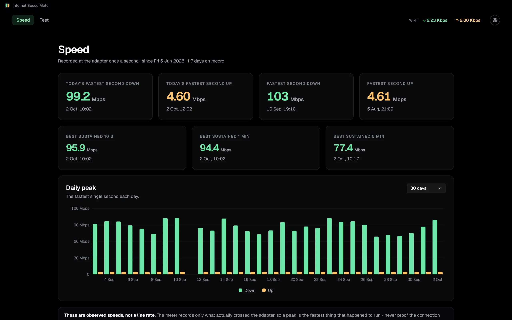
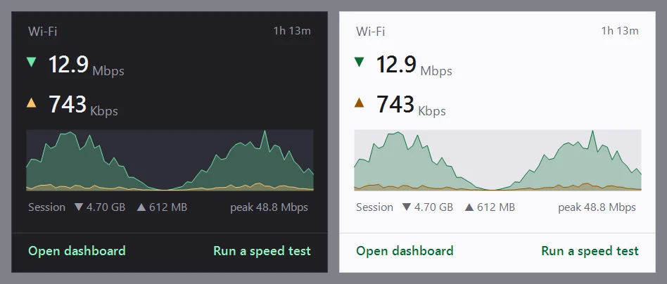
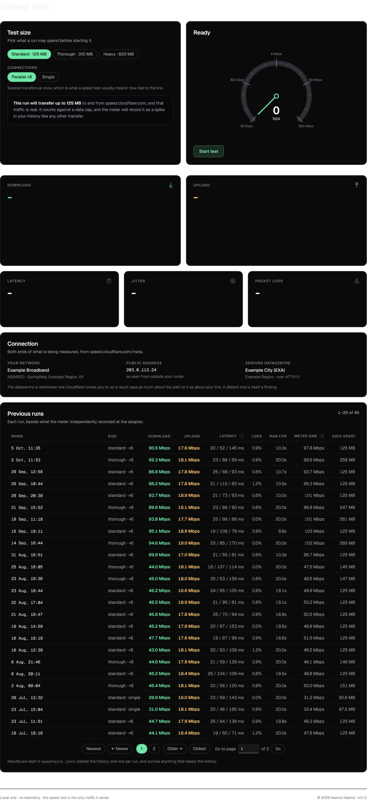
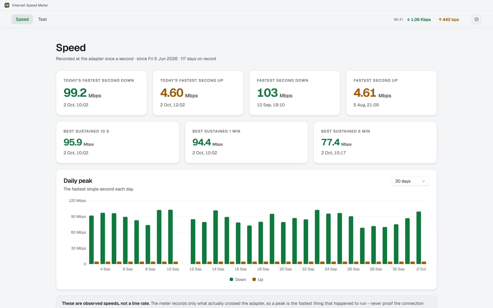

# Internet Speed Meter

[](https://github.com/naimulnashid/internet-speed-meter-native/actions/workflows/ci.yml)
[](https://github.com/naimulnashid/internet-speed-meter-native/releases/latest)
[](LICENSE)

Live download and upload speed on the Windows taskbar, in the clock's own
size, with a permanent history of what the connection has done and a speed
test of what it can do. One native app, no browser, no server.



## What it does

**On the taskbar.** Two stacked lines beside the clock, ↓ and ↑, in the
clock's font and size, riding the taskbar when it auto-hides and staying
above it when Start opens. Where the taskbar has no room (vertical, crowded),
the numbers move into the tray icon instead, drawn pixel by pixel so "9.4M"
still reads at 16 px. Units in bytes (MB/s) or bits (Mbps).

**A click away.** Clicking the numbers opens a panel with the current rates,
the last minute as a graph, and this session's totals.



**The dashboard.** Double-click, or pick *Open dashboard*, for the window:

- **Speed**: the fastest second today and ever, each way; the best sustained
  10 s, 1 min and 5 min download averages; and the fastest second of every
  day, over a week, a month, three months or everything. These are observed
  speeds - what actually crossed the adapter - not a line rate.
- **Test**: an active speed test against speed.cloudflare.com, parallel or
  single-connection, with latency measured idle and under load (so
  bufferbloat shows), jitter, and packet loss from ICMP. Every run is kept,
  beside the fastest second the meter itself saw at the adapter while it ran:
  two independent measurements that should agree.



Dark, light, or follow Windows; page zoom with Ctrl+Plus/Minus and Ctrl+wheel;
loading skeletons that are the page's own layout; a pager that jumps to any
page of the run history.



## What it costs

The meter is what runs all day, and it is small: about 17 MB of private
memory and a sample a second. The dashboard is a separate process of the same
app, started when its window opens and gone when it closes, so its framework
(WinUI 3) never sits in memory behind a closed window.

**Nothing leaves the machine**, except a speed test you start: it transfers
the amount it says it will (125 MB for Standard) to and from
speed.cloudflare.com. No telemetry, no accounts, no update checks.

## Install

Windows 10 (2004) or 11, x64. No administrator rights.

**From a release:** download `InternetSpeedMeter-<version>-win-x64.zip` from
[Releases](https://github.com/naimulnashid/internet-speed-meter-native/releases),
extract it, and run:

```powershell
powershell -ExecutionPolicy Bypass -File .\Install.ps1
```

**From source** (needs the .NET 10 SDK):

```powershell
powershell -ExecutionPolicy Bypass -File tools\Install.ps1
```

Either way it installs to `%LOCALAPPDATA%\Programs\Internet Speed Meter`
(about 210 MB: it carries its own .NET and Windows App SDK), adds a Start menu
entry and an Installed apps entry, starts with Windows, and starts now.
`Install.ps1 -NoStartup` leaves start-with-Windows off; `-Uninstall` removes
it (or use Settings > Apps). **Uninstalling never deletes the history.**

## Using it

| | |
|---|---|
| Click the taskbar numbers or the tray icon | details panel |
| Double-click either, or *Open dashboard* | the dashboard |
| Right-click either | the menu: what to show and where, adapter, units, icon layout, start with Windows, exit |
| The dashboard's ⚙ menu | theme, units, notifications, zoom, export history as CSV, open the history folder, exit |

Closing the dashboard leaves the meter running. *Exit*, from either menu,
stops both.

### Settings and history

Settings live in `%AppData%\InternetSpeedMeter\settings.ini` (plain
`key=value`), and the history wherever its `logfolder` says - by default
`%LocalAppData%\InternetSpeedMeter\history`. Point `logfolder` at another
drive if the history should survive a Windows reset.

| Key | Default | |
|---|---|---|
| `units` | `bytes` | `bytes` or `bits` |
| `adapter` | `auto` | `auto` (busiest), `all` (summed), or an adapter id |
| `taskbartext` / `traynumbers` | `1` / `0` | where the numbers are shown |
| `side` | `left` | which end of the taskbar the text sits at |
| `record` | `1` | `0` stops recording |
| `logfolder` | `%LocalAppData%\InternetSpeedMeter\history` | minute history, kept forever |
| `rawfolder` | `%LocalAppData%\InternetSpeedMeter\raw` | one-second samples; empty for minutes only |
| `rawretentiondays` | `14` | how long one-second samples are kept |
| `activethresholdbps` | `51200` | combined rate at which a second counts as active |

The history is two fixed-width binary logs, little-endian, append-only:

| File | Record | Fields |
|---|---|---|
| `history/YYYY-MM.bin` | 40 bytes a minute | u32 unix minute, u64 down bytes, u64 up bytes, u32 fastest second down, u32 fastest second up, u16 samples, u16 active samples, u8 adapter, u8 flags, 6 reserved |
| `raw/YYYY-MM-DD.bin` | 16 bytes a second | u32 unix second, u32 down bytes, u32 up bytes, u16 elapsed ms, u8 adapter, u8 flags |

Flags: 1 connected, 2 gap (a stretched window, such as a resume from sleep),
4 adapter changed, 8 meter started (minutes only). `adapters.tsv` beside the
minute files names each adapter byte; `speedtests.jsonl` holds one speed test
per line. *Export history as CSV* (or `speedmeter export-csv`) turns any of it
into a spreadsheet.

**Coming from the earlier C# meter or its web dashboard?** This is their
successor, and reads the same `settings.ini`, the same history and the same
`speedtests.jsonl`: everything they recorded carries on here. On first start
it offers to stop the older meter, since two meters must not record at once,
and the installer moves start-with-Windows over to this app.

## Command line

`speedmeter.exe` (in `src\SpeedMeter.Cli`) reads the same history:

```text
speedmeter sample [seconds] [file]          the adapters, then a line a second of what the meter sees
speedmeter stats                            where the history is, and its records
speedmeter export-csv <from> <to> [file] [--raw]
speedmeter speedtest [--profile standard|thorough|heavy] [--single] [--save]
speedmeter demo-data <folder>               an invented history, for screenshots
```

`SpeedMeter.exe --preview-icon out.png` and `--preview-flyout out.png` draw
the tray icon at every size and the details panel, both taskbar themes.

## Building

```powershell
dotnet build SpeedMeterNative.slnx
dotnet test --project tests\SpeedMeter.Core.Tests\SpeedMeter.Core.Tests.csproj
```

`src\SpeedMeter.Core` has no UI: settings, sampling, the recorder and reader,
statistics, the speed test. `src\SpeedMeter.App` is the app: the meter
(WinForms, in `Meter\`) and the dashboard (WinUI 3). The screenshots here are
of invented data (`speedmeter demo-data demo-data`), rendered by
`tools\Snapshot.ps1`.

## License

[MIT](LICENSE). Geist and Geist Mono are bundled under the SIL Open Font
License (`src/SpeedMeter.App/Assets/Fonts/OFL.txt`).
